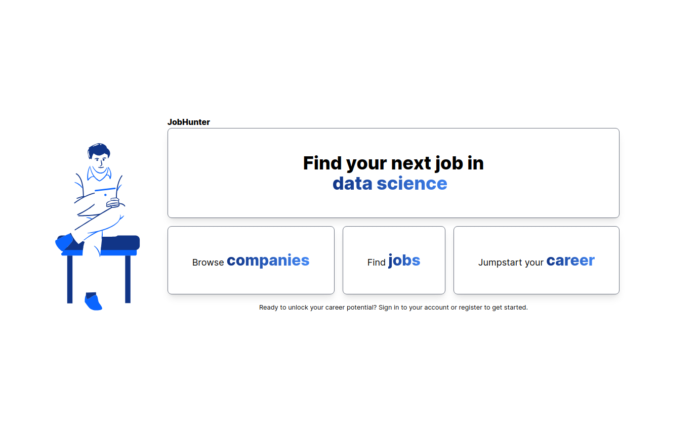

<a name="readme-top"></a>
<!-- PROJECT SHIELDS -->
<!--
*** I'm using markdown "reference style" links for readability.
*** Reference links are enclosed in brackets [ ] instead of parentheses ( ).
*** See the bottom of this document for the declaration of the reference variables
*** for contributors-url, forks-url, etc. This is an optional, concise syntax you may use.
*** https://www.markdownguide.org/basic-syntax/#reference-style-links
-->

<div align="center"></div>

<h3 align="center">Jobhunter</h3>

  <p align="center">
    <br />
    <a href="https://github.com/jclark1913/jobhunter"><strong>View documentation »</strong></a>
    <br />
    <br />
    <a href="https://jobhunter.justinclark.bio">View Demo</a>
  </p>
</div>

<div align="center">


</div>

<!-- TABLE OF CONTENTS -->
<details>
  <summary>Table of Contents</summary>
  <ol>
    <li>
      <a href="#about-the-project">About The Project</a>
      <ul>
        <li><a href="#built-with">Built With</a></li>
      </ul>
    </li>
    <li>
      <a href="#getting-started">Getting Started</a>
    </li>
    <li><a href="#license">License</a></li>
    <li><a href="#contact">Contact</a></li>
    <li><a href="#acknowledgments">Acknowledgments</a></li>
  </ol>
</details>


<!-- ABOUT THE PROJECT -->
## About The Project

Jobhunter is a lightweight single-page application that allows users to create an account, search jobs and track
companies. I initially started this project in spring 2023 as part of <a href="https://rithmschool.com">Rithm School's</a> curriculum, but I redid the website recently using Vite and Vercel.

The frontend is built in React, with a <a href="https://github.com/jclark1913/express-jobly">backend</a> written in Express/Node.js. The database
uses PostgreSQL for relational tables using data generated with Faker.js.

<p align="right">(<a href="#readme-top">back to top</a>)</p>

### Built With

<div align="center">

![React][React]
![React Router][React Router]
![PostgreSQL][PostgreSQL]
![ElephantSQL][ElephantSQL]
![Render][Render]
![Node.js][Node.js]
![Express][Express]
![TypeScript][TypeScript]

</div>

<p align="right">(<a href="#readme-top">back to top</a>)</p>


<!-- GETTING STARTED -->
## Getting Started

To see the project in action, visit the <a href="jobhunter.justinclark.bio">demo</a>.

Otherwise, to build Jobhunter from source:

1. Clone backend and frontend repos onto your machine:

```bash
git clone https://github.com/jclark1913/jobhunter
git clone https://github.com/jclark1913/jobly-backend
```

2. Create and seed the database

```bash
createdb jobly
cd jobly-backend
psql jobly.sql
```

3. Install dependencies and run the backend server (defaults to port `5147`)

```bash
cd jobly-backend
npm install
npm run start
```

4. Install dependencies and run the frontend server (defaults to port `5147`)

```bash
cd jobhunter
npm install
npm run start
```

4. Visit `localhost:5147`

<p align="right">(<a href="#readme-top">back to top</a>)</p>


<!-- LICENSE -->
## License

Distributed under the MIT License. See `LICENSE.txt` for more information.

<p align="right">(<a href="#readme-top">back to top</a>)</p>


<!-- CONTACT -->
## Contact

Justin Clark - [@JustinClarkJO](https://twitter.com/@JustinClarkJO) - jclarksummit AT gmail DOT com

Project Link: [https://github.com/jclark1913/jobhunter](https://github.com/jclark1913/jobhunter)

<p align="right">(<a href="#readme-top">back to top</a>)</p>


<!-- ACKNOWLEDGMENTS -->
## Acknowledgments

I completed v1 of this project during my time at [Rithm School](https://rithmschool.com). A big thanks to all the instructors
and classmates who encouraged and supported me during that time.

* [Rithm School](https://rithmschool.com)
* [Best-README-Template](https://github.com/othneildrew/Best-README-Template)

<p align="right">(<a href="#readme-top">back to top</a>)</p>


<!-- MARKDOWN LINKS & IMAGES -->
<!-- https://www.markdownguide.org/basic-syntax/#reference-style-links -->
[contributors-shield]: https://img.shields.io/github/contributors/jclark1913/jobly_frontend.svg?style=for-the-badge
[contributors-url]: https://github.com/jclark1913/jobhunter/graphs/contributors
[forks-shield]: https://img.shields.io/github/forks/jclark1913/jobhunter.svg?style=for-the-badge
[forks-url]: https://github.com/jclark1913/jobhunter/network/members
[stars-shield]: https://img.shields.io/github/stars/jclark1913/jobhunter.svg?style=for-the-badge
[stars-url]: https://github.com/jclark1913/jobhunter/stargazers
[issues-shield]: https://img.shields.io/github/issues/jclark1913/jobhunter.svg?style=for-the-badge
[issues-url]: https://github.com/jclark1913/jobhunter/issues
[license-shield]: https://img.shields.io/github/license/jclark1913/jobhunter.svg?style=for-the-badge
[license-url]: https://github.com/jclark1913/jobhunter/blob/master/LICENSE.txt
[linkedin-shield]: https://img.shields.io/badge/-LinkedIn-black.svg?style=for-the-badge&logo=linkedin&colorB=555
[linkedin-url]: https://linkedin.com/in/linkedin_username
[product-screenshot]: docs/jobs.png
[React]: https://img.shields.io/badge/React-61DAFB?logo=react&logoColor=white
[React.js]: https://img.shields.io/badge/React-20232A?style=for-the-badge&logo=react&logoColor=61DAFB
[React-url]: https://reactjs.org/
[Bootstrap.com]: https://img.shields.io/badge/Bootstrap-563D7C?style=for-the-badge&logo=bootstrap&logoColor=white
[Bootstrap-url]: https://getbootstrap.com
[PostgreSQL]: https://img.shields.io/badge/PostgreSQL-4169E1?logo=postgresql&logoColor=white
[ElephantSQL]: https://img.shields.io/badge/ElephantSQL-2D9CDB?logo=elephantsql&logoColor=white
[Render]: https://img.shields.io/badge/Render-000000?logo=render&logoColor=white
[Express]: https://img.shields.io/badge/Express-000000?logo=express&logoColor=white
[Node.js]: https://img.shields.io/badge/Node.js-339933?logo=node.js&logoColor=white
[React Router]: https://img.shields.io/badge/React_Router-CA4245?logo=react-router&logoColor=white
[TypeScript]: https://img.shields.io/badge/TypeScript-3178C6?logo=typescript&logoColor=white
[TypeScript-url]: https://www.typescriptlang.org/
